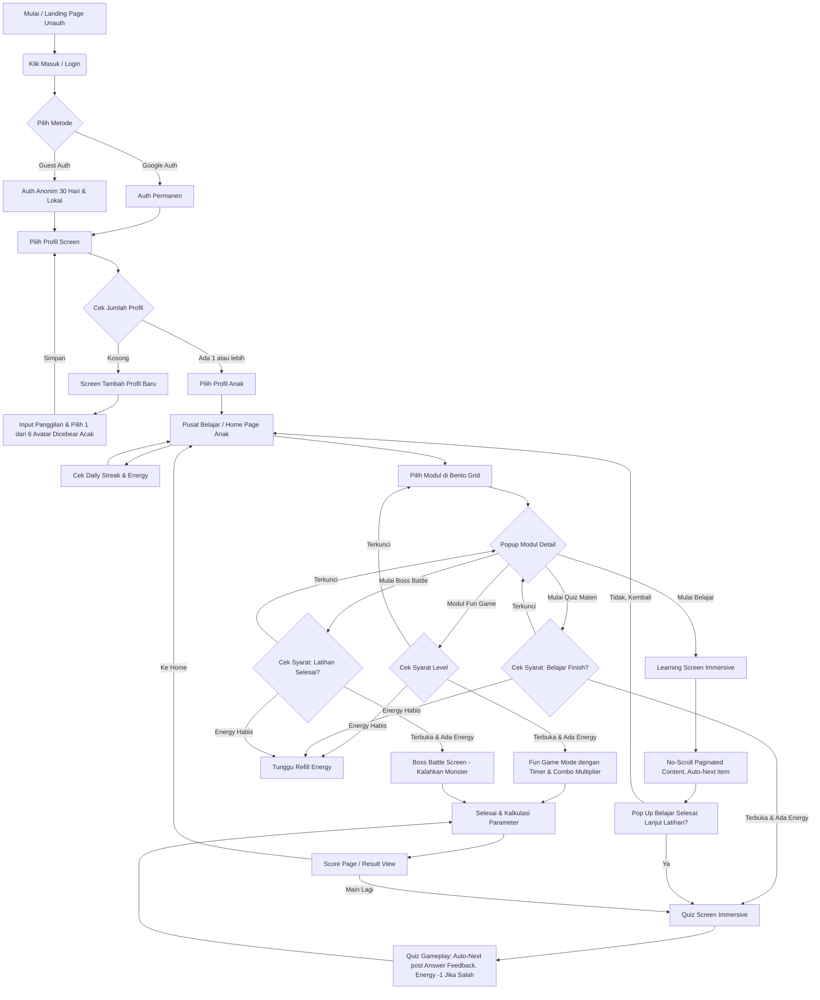

# Panduan Lengkap UI/UX Flow & Arsitektur Navigasi "SAYA BACA"

Terakhir Diperbarui: 2026-05-02
Status: Disetujui 

Dokumen ini menjelaskan alur navigasi dari awal pengguna masuk hingga menyelesaikan sesi belajar atau quiz, beserta spesifikasi layout komponen global (Immersive Mode).

---

## 1. Flowchart Utama Aplikasi



---

## 2. Sistem Gamifikasi Terintegrasi

### A. Sistem "Nyawa" / Heart (Energy System)
- **Logika:** Maksimal nyawa (e.g., 5). Berkurang 1 setiap kali anak *salah menjawab* di Quiz atau Boss Battle. 
- **Refill Timer:** Pulih otomatis setiap 30 menit (atau interval lain).
- **Pengaruh UI:** Ditampilkan di dalam HUD (TopBar). Jika habis, tombol Quiz/Game menjadi disabled dengan informasi sisa waktu refill.

### B. Daily Streak & Goals
- Merekam jumlah login harian berturut-turut.
- Tampil sebagai popup perayaan (atau di Home/TopBar) saat pertama kali masuk di hari tersebut.
- Diverifikasi melalui backend untuk mencegah manipulasi waktu lokal `Date.now()`.

### C. Mascot Dinamis & Emosional
- **Posisi:** Berada mendampingi di sisi layar atau bagian atas soal.
- **Feedback:** Berganti ekspresi dinamis sesuai aksi (selebrasi saat benar, sedih/menyemangati saat salah). Menggunakan sprite bergilir atau animasi Lottie.

### D. Economy & Store (Reward System)
- Pengumpulan mata uang in-game berupa **Point (🪙)** (atau koin).
- **Fungsi:** Dapat dibelanjakan di menu *Store* untuk modifikasi avatar, bingkai (frame), skin mascot, dsb.

### E. Leaderboard & Liga (League)
- Sistem pemeringkatan global/lokal berdasarkan total point mingguan.
- Memberikan dorongan kompetitif yang sehat secara berkala.

### F. Dual-Format Module System
**A. Modul Edukasi Utama**
- **Flow:** Belajar -> Latihan -> Evaluasi/Boss Monster.
- **Karakteristik:** TIDAK MENGGUNAKAN TIMER agar anak tidak merasa tertekan saat belajar dasar. Fokus pada akurasi.

**B. Modul Fun Game / Minigame**
- **Flow:** Bermain langsung tanpa materi belajar (hanya untuk pengayaan & motorik).
- **Syarat:** Harus "Locked by Level" agar pemain tidak *skip* materi edukasi.
- **Karakteristik:** MENGGUNAKAN TIMER, SPEED MULTIPLIER, dan COMBO untuk skor maksimal.

---

## 3. Struktur Layout (TopBar & BottomBar Context-Aware)

Aplikasi SAYA BACA membedakan navigasi antara **Tahap Eksplorasi** dan **Tahap Imersif**.

### Aturan Global BottomBar (BottomNav)
Diambil alih kontrolnya melalui *Zustand Store*.
- **TAMPIL (`isVisible: true`):** Landing Page, Home Page, Leaderboard, Store.
- **DISEMBUNYIKAN (`isVisible: false`):** Pilih Profil, Tambah Profil, Learning Screen, Quiz Screen, Boss Battle, Minigame, Score/Result Screen. *(Tujuan: memberikan 100% layar untuk konten anak).*

### Aturan Global TopBar (Mode Eksplorasi vs Mode Imersif)

Saat berada di dalam Modul (Learning/Quiz/Play), TopBar tidak boleh berisi logo aplikasi, melainkan **HUD (Heads-Up Display) Game**.

**Bagian Kiri (Navigasi & Identitas):**
- **Back / Escape Button** (Konfirmasi keluar).
- **Avatar Anak + Badge Level** (Pojok avatar).
- **Teks Greeting** ("Halo, Budi").

**Bagian Kanan (Status & Aksi):**
- **Pill Group Point Current (🪙):** Menampilkan skor dinamis/poin yang sedang berjalan.
- **Pill Group EXP Global (⭐):** Menampilkan total jam terbang/pengalaman anak.
- **Pill Group Energy (❤️):** Menunjukkan sisa nyawa main.
- **Pill Group Timer (⏱️):** (Khusus Fun Game).
- **Settings Toggle (Hamburger Icon):** Dropdown opsi untuk Darkmode, Text Size, Parent Gate.

---

## 4. Spesifikasi Screen Spesifik

### A. Authentication & Link Account
- **Guest:** Menggunakan `signInAnonymously()` Firebase. Di sisi DB, Firestore Rules / Cron Job bisa menghapus akun anonim berumur >30 hari (opsional).
- **Syncing:** Di menu settings nanti, *Guest account* dapat digabungkan dengan Google Auth via `linkWithCredential()` agar data tidak hilang.

### B. Profile Selection (`/profiles`) & Creation (`/profiles/new`)
- Tidak dipasang dalam Dashboard Homepage sebagai Modal. Ini adalah ruang perantara transisi yang *isolated*.
- **Avatar Dicebear Controller:** 
  Punya array 6 items yang di generate dari string `Math.random()`. Jika diklik "Acak", render ulang array dengan id baru, otomatis memanggil API `https://api.dicebear.com/7.x/adventurer/svg?seed=[random_string]`

### C. Learning & Quiz Engine (No-Scroll Pattern)
- Komponen menggunakan ketinggian `100dvh - topbarHeight` dengan `overflow: hidden`.
- **Auto-Next Behavior (Learning):** Saat deretan abjad/huruf dalam halaman itu selesai di-klik, sistem jeda 1 detik, lalu pindah halaman.
- **Auto-Next Behavior (Quiz):** User klik salah satu jawaban -> Blok menjadi **Merah** (jika salah) atau **Hijau** (jika benar) + Audio feedback + Maskot merespons. Jeda 1.5 detik -> Lanjut soal berikutnya. Kesalahan akan mengurangi 1 Energy (Nyawa).

### D. Result / Score Screen (`/score/[id]`)
- Muncul setelah stage usai.
- Menampilkan foto Profil Anak, Angka Nilai Akhir (0-100), Bintang (1 hingga 5), Tambahan EXP, Tambahan Point 🪙, Soal Benar/Salah.
- Harus atraktif dengan konfeti (*canvas-confetti* library).

---

## 5. Manajemen State Terpusat (Zustand `useGameStore.ts`)

Dibangun secara khusus terpisah dari DB Calls untuk menjamin kecepatan 60FPS UI:
```typescript
interface GameState {
  // Global Setup
  activeProfile: Profile | null;
  setActiveProfile: (p: Profile) => void;
  
  // HUD Visibility Control
  isBottomNavVisible: boolean;
  setBottomNavVisible: (val: boolean) => void;

  // Realtime Live Session (Learn/Quiz/Minigame)
  currentSessionPoints: number;
  addSessionPoints: (pts: number) => void;
  resetSessionPoints: () => void;
  comboCount: number; // For Minigame multiplier
  
  // Realtime Player Stats
  globalExp: number;
  setGlobalExp: (exp: number) => void;
  addGlobalExp: (exp: number) => void;
  energy: number;
  decreaseEnergy: () => void;
}
```
