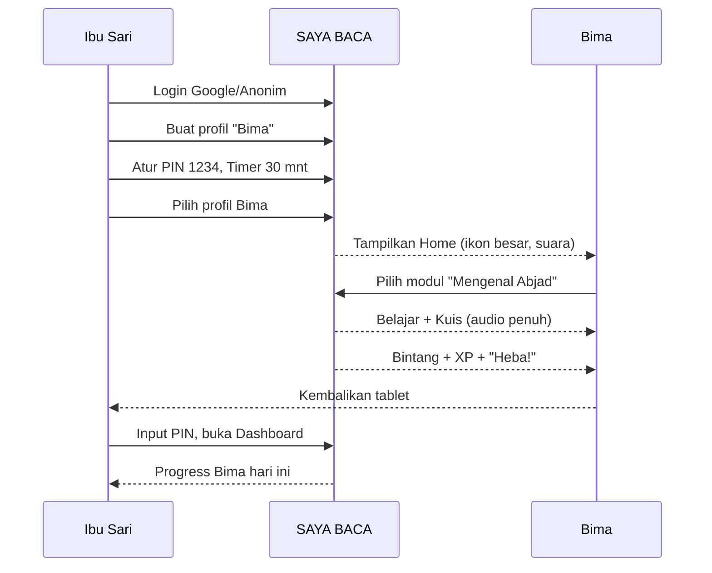

# 04_personas.md

## Personas: SAYA BACA

| Aspek | Keputusan |
|-------|-----------|
| **Nama Produk** | SAYA BACA |
| **Versi Dokumen** | 1.0 |
| **Tanggal** | 2026-05-01 |
| **Status** | Final |

---

### 1. Tujuan Dokumen

Mendefinisikan persona pengguna utama **SAYA BACA** secara mendetail. Persona ini akan menjadi acuan utama untuk setiap keputusan desain UX, penulisan user story, dan penyusunan acceptance criteria. Setiap fitur harus diuji terhadap kedua persona ini.

---

### 2. Persona 1: Anak PAUD/TK (Pengguna Akhir)

#### 2.1 Profil

| Atribut | Detail |
|---------|--------|
| **Nama Persona** | Bima |
| **Usia** | 4 tahun |
| **Pendidikan** | TK A |
| **Kemampuan Membaca** | Pemula mutlak — baru mengenal 5-10 huruf kapital. Belum bisa menyusun suku kata. |
| **Akses Perangkat** | Meminjam smartphone orang tua (Android) atau tablet keluarga. |
| **Frekuensi Penggunaan** | 3-4 kali seminggu, 20-30 menit per sesi. |
| **Lingkungan Belajar** | Di rumah, ditemani orang tua, biasanya sore hari setelah orang tua pulang kerja. |

#### 2.2 Tujuan & Motivasi

| Tujuan | Deskripsi |
|--------|-----------|
| **Mengenal huruf** | Ingin tahu bentuk dan bunyi semua huruf. |
| **Merasa "bisa"** | Termotivasi ketika mendengar "Heba! Jawabanmu Benar." Ingin merasa pintar dan dipuji. |
| **Mengoleksi bintang** | Ingin melihat bintang penuh di layar setelah selesai kuis. |
| **Bermain sambil belajar** | Tidak bisa dibedakan antara "belajar" dan "bermain". Semuanya harus terasa seperti bermain. |

#### 2.3 Frustrasi & Pain Points

| Frustrasi | Deskripsi |
|-----------|-----------|
| **Tombol terlalu kecil** | Jari masih belum presisi. Tombol kecil atau terlalu rapat bikin frustasi dan salah klik. |
| **Teks instruksi panjang** | Belum bisa membaca teks instruksi. Hanya mengandalkan ikon dan suara. |
| **Menunggu loading** | Tidak sabar menunggu layar loading lebih dari 2 detik. Akan pencet-pencet layar atau tinggalkan aplikasi. |
| **Navigasi dalam** | Jika harus melewati lebih dari 3 layar untuk mulai belajar, Bima akan tersesat. |
| **Feedback negatif keras** | Tidak suka bunyi "coba lagi" yang terdengar menghakimi atau nada tinggi. Lebih baik "Yuk, coba lagi!" dengan nada ceria. |

#### 2.4 Perilaku Khas

- Belajar dengan jari telunjuk, bukan ibu jari.
- Suka menekan-nekan layar berulang kali.
- Menirukan suara yang keluar dari aplikasi.
- Mudah terdistraksi oleh elemen yang bergerak atau berwarna mencolok di luar area fokus.
- Akan mengulang kuis yang sudah berhasil berkali-kali jika merasa senang.

#### 2.5 Kebutuhan Khusus untuk Desain

| Kebutuhan | Implementasi |
|-----------|-------------|
| **Touch target besar** | Minimal 64x64dp, jarak antar tombol minimal 16dp. |
| **Navigasi datar** | Maksimal 3 langkah dari Home ke konten. |
| **Audio wajib** | Semua instruksi, tombol, soal, dan feedback harus bersuara (TTS + SFX). |
| **Ikon universal** | Gunakan ikon yang dikenal anak: bintang untuk "bagus", rumah untuk "pulang", telinga untuk "dengarkan". |
| **Warna primer cerah tapi tidak mencolok** | Hindari warna neon. Gunakan palet playful tapi lembut di mata. |
| **Tidak ada gesture kompleks** | Hanya tap. Tidak ada swipe, pinch, atau drag-and-drop kecuali mini game khusus (Should/Could). |

---

### 3. Persona 2: Orang Tua / Wali (Pengelola Akun)

#### 3.1 Profil

| Atribut | Detail |
|---------|--------|
| **Nama Persona** | Ibu Sari |
| **Usia** | 32 tahun |
| **Pekerjaan** | Karyawan swasta, bekerja 8-5. |
| **Jumlah Anak** | 2 (Bima, 4 tahun) dan (Dina, 6 tahun). |
| **Melek Teknologi** | Menengah. Lancar menggunakan smartphone, familiar dengan aplikasi anak, tapi tidak teknis. |
| **Akses Perangkat** | Smartphone Android pribadi. |
| **Frekuensi Cek Dashboard** | 1-2 kali seminggu, biasanya Sabtu pagi saat santai. |

#### 3.2 Tujuan & Motivasi

| Tujuan | Deskripsi |
|--------|-----------|
| **Pantau kemajuan** | Ingin tahu Bima sudah bisa apa saja, huruf mana yang masih sulit. |
| **Kontrol screen time** | Ingin Bima belajar maksimal 30 menit per sesi. Khawatir kecanduan gadget. |
| **Keamanan** | Ingin memastikan Bima tidak bisa chat dengan orang asing atau mengubah pengaturan sendiri. |
| **Rekomendasi** | Ingin tahu apa yang harus diajarkan selanjutnya di rumah. |

#### 3.3 Frustrasi & Pain Points

| Frustrasi | Deskripsi |
|-----------|-----------|
| **Aplikasi anak penuh iklan** | Marbel dan sejenisnya sering muncul iklan yang tidak pantas atau membuat anak tidak sengaja klik. |
| **Tidak ada laporan jelas** | Banyak aplikasi tidak memberi tahu anaknya sudah belajar apa. |
| **Akun ribet** | Tidak mau daftar panjang-panjang. Ingin langsung pakai akun Google atau masuk tanpa daftar. |
| **Pengaturan tersembunyi** | Kesal kalau menu kontrol orang tua susah dicari. Harus jelas dan mudah diakses. |

#### 3.4 Perilaku Khas

- Membuka aplikasi, memilih profil Bima, lalu memberikan tablet ke Bima.
- Setelah Bima selesai, kembali membuka dashboard untuk melihat hasil.
- Mengatur timer dan PIN di awal, lalu jarang mengubahnya kecuali ada masalah.
- Akan merekomendasikan aplikasi ke grup WhatsApp orang tua jika merasa puas.

#### 3.5 Kebutuhan Khusus untuk Desain

| Kebutuhan | Implementasi |
|-----------|-------------|
| **Login cepat** | Login dengan Google 1 klik, atau login anonim langsung. |
| **Dashboard ringkas** | Tampilkan informasi penting di satu layar: progress modul, skor, waktu belajar. |
| **PIN intuitif** | PIN 4 digit, input numeric keypad besar. |
| **Akses pengaturan mudah** | Menu "Orang Tua" dengan ikon gembok, selalu di halaman profil. |
| **Mode offline jelas** | Indikator jika konten belum diunduh untuk offline. |
| **Privasi jelas** | Bahasa yang menjelaskan bahwa data anak tidak dibagikan ke pihak mana pun. |

---

### 4. Flow Interaksi Antar Persona

