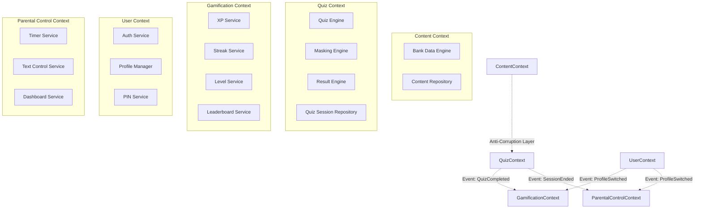
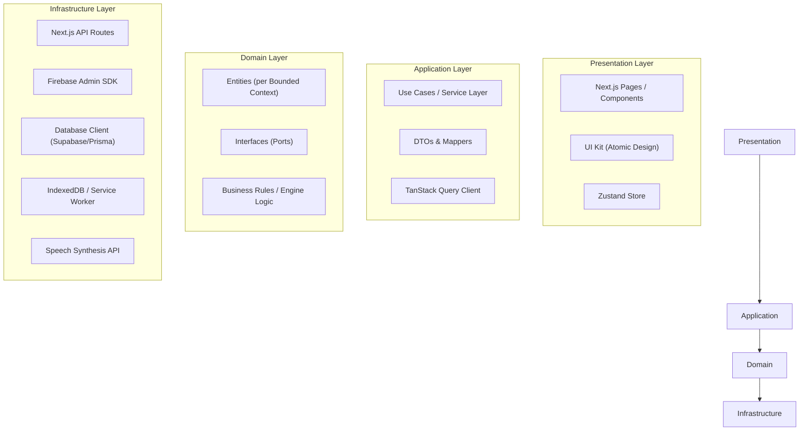
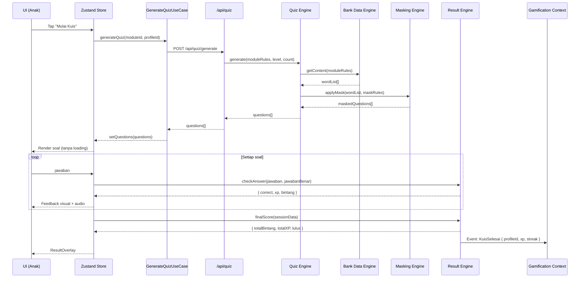
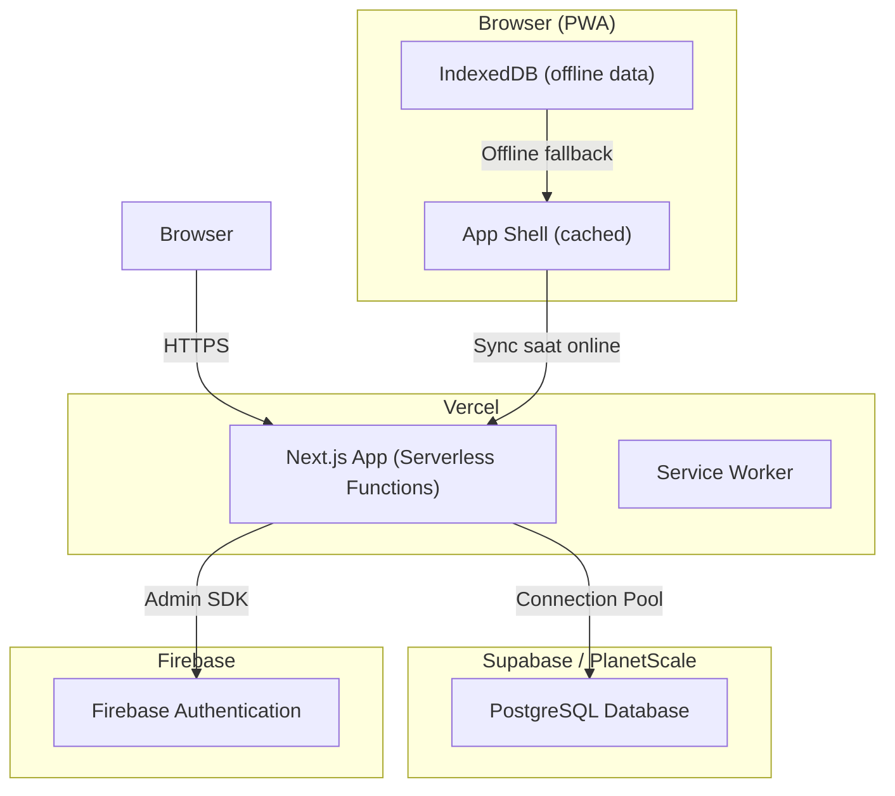

# 10_architecture.md

## Architecture: SAYA BACA

| Aspek | Keputusan |
|-------|-----------|
| **Nama Produk** | SAYA BACA |
| **Versi Dokumen** | 1.0 |
| **Tanggal** | 2026-05-01 |
| **Status** | Final |

---

### 1. Tujuan Dokumen

Dokumen ini mendeskripsikan arsitektur teknis **SAYA BACA** secara menyeluruh. Mencakup tech stack, layered design, Microkernel/Plug-in module map, bounded context map, event flow, dan deployment topology. Dokumen ini menjadi kontrak utama bagi Agent Coder untuk memahami bagaimana sistem dibangun.

---

### 2. Tech Stack

| Layer | Teknologi | Justifikasi |
|-------|-----------|-------------|
| **Frontend** | Next.js 15+ (App Router), React 19+, TypeScript 5+ | PWA, SSG untuk konten belajar, ekosistem yang diminta. |
| **UI Kit** | Atomic Design (Atom, Molekul, Organisme) — sebagian tersedia, sebagian perlu dibangun (lihat UI Spec). | Sudah disediakan. |
| **State Management** | Zustand (client state) + React Query / TanStack Query (server state) | Ringan, tidak overkill, mendukung pola Dumb UI. |
| **Backend / API** | Next.js API Routes (Route Handlers) | Satu repositori, satu deployment. API Route bertindak sebagai Backend-for-Frontend (BFF). |
| **Auth** | Firebase Authentication (Google + Anonymous + Account Linking) | Cepat, aman, memenuhi kebutuhan login. |
| **Database** | PostgreSQL via Supabase atau PlanetScale (serverless) | Relasional, mendukung bounded context terpisah, row-level security. |
| **Cache / Offline** | IndexedDB (via idb-keyval) untuk offline storage, Service Worker (Workbox) untuk asset caching | PWA offline-ready. |
| **TTS & Audio** | Browser Speech Synthesis API (TTS) + Howler.js untuk SFX | Tidak perlu server TTS, klien-side cukup. |
| **Observability** | Structured logging (pino), OpenTelemetry tracing (opsional v1.1) | 12-Factor App. |
| **CI/CD** | GitHub Actions + Vercel (deploy) | Otomatis, zero-downtime. |
| **Infra** | Vercel (hosting Next.js) + Supabase/PlanetScale (DB) + Firebase (Auth) | Serverless, skalabel, minim operasi. |

---

### 3. Arsitektur Microkernel / Plug-in

#### 3.1 Module Map

```mermaid
graph TD
    subgraph Core["Core System (Microkernel)"]
        Router["Router & DI Container"]
        Auth["Auth Module"]
        Profile["Profile Manager"]
        Pin["PIN Service"]
        Timer["Timer Service"]
        TextCtrl["Text Control Service"]
        BD[("Bank Data Engine")]
        QE["Quiz Engine"]
        ME["Masking Engine"]
        RE["Result Engine"]
        EventBus["Event Bus"]
    end

    subgraph Plugins["Plug-in Modules (Belajar & Mini Games)"]
        Mod1["Modul: Mengenal Abjad"]
        Mod2["Modul: Huruf Vokal"]
        Mod3["Modul: Merakit Kalimat"]
        MG1["Mini Game: Balon Kata"]
        MG2["Mini Game: (future)"]
    end

    subgraph External["External Services"]
        Firebase["Firebase Auth"]
        Supabase["Supabase / PlanetScale"]
    end

    Mod1 -->|interface: IQuizRule| QE
    Mod2 -->|interface: IQuizRule| QE
    Mod3 -->|interface: IQuizRule| QE
    MG1 -->|interface: IQuizRule| QE
    
    Mod1 -->|interface: IMaskRule| ME
    Mod2 -->|interface: IMaskRule| ME
    Mod3 -->|interface: IMaskRule| ME
    
    Mod1 -->|interface: IResultRule| RE
    Mod2 -->|interface: IResultRule| RE
    Mod3 -->|interface: IResultRule| RE

    Mod1 -->|interface: IContentBank| BD
    Mod2 -->|interface: IContentBank| BD
    Mod3 -->|interface: IContentBank| BD

    Router --> Auth
    Auth --> Firebase
    Router --> Profile
    Profile --> Supabase
    BD --> Supabase
    EventBus --> Timer
    EventBus --> TextCtrl
    Pin --> Profile
```

#### 3.2 Penjelasan

- **Core System** hanya berisi kerangka dan 4 engine. Core TIDAK tahu tentang modul spesifik (tidak import kode modul).
- **Plug-in Module** mendaftarkan diri via interface yang disediakan core. Modul mengirim aturan (rule) ke engine, engine yang menghasilkan data matang.
- **Event Bus** memungkinkan komunikasi antar bounded context tanpa kopling langsung (misal: "KuisSelesai" → Gamification context update XP).

---

### 4. Bounded Context Map (DDD)

**Aturan DDD**:
- Setiap bounded context memiliki model domain sendiri. Misal, "User" di User Context berbeda dengan "User" di Gamification Context (hanya butuh userId + XP).
- Komunikasi antar context hanya melalui event atau interface (anti-corruption layer), tidak pernah akses database langsung.

---

### 5. Clean Architecture Layer

**Aturan Ketat (Agent Coder Harus Patuh)**:
- **Presentation** hanya render data dan emit event. TIDAK BOLEH ada business logic.
- **Application** berisi use case spesifik (misal: `GenerateQuizUseCase`, `CheckAnswerUseCase`). Boleh panggil domain service.
- **Domain** adalah inti bisnis. Tidak boleh bergantung pada framework, database, atau library eksternal.
- **Infrastructure** mengimplementasikan interface dari domain layer. Semua koneksi eksternal di sini.

---

### 6. Event Flow: Sesi Kuis Lengkap

---

### 7. Deployment Topology

