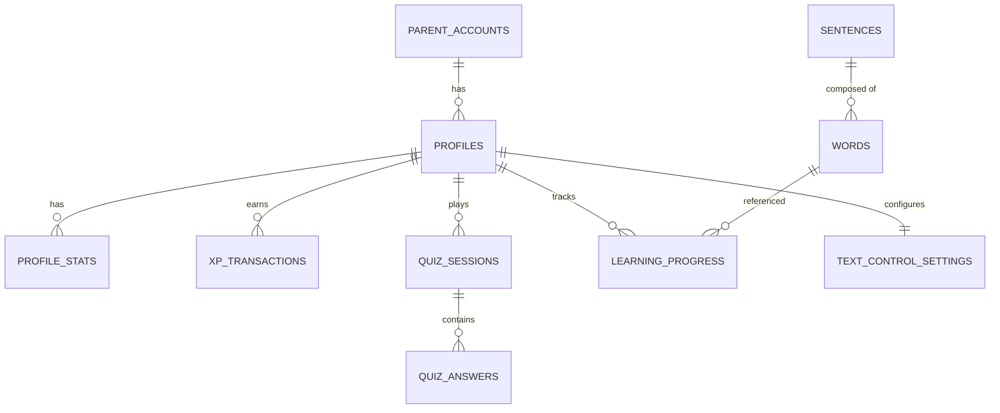

# 11_database_schema.md

## Database Schema: SAYA BACA

| Aspek | Keputusan |
|-------|-----------|
| **Nama Produk** | SAYA BACA |
| **Versi Dokumen** | 1.0 |
| **Tanggal** | 2026-05-01 |
| **Status** | Final |

---

### 1. Tujuan Dokumen

Dokumen ini mendefinisikan skema database untuk SAYA BACA. Skema dirancang per bounded context (Content, Quiz, Gamification, User, Parental Control) dan tidak mengandung business logic (tidak ada stored procedures, tidak ada triggers bisnis). Agent Coder akan menggunakan skema ini sebagai kontrak untuk migration dan ORM.

---

### 2. Prinsip Skema

| Prinsip | Implementasi |
|---------|-------------|
| **No Business Logic in DB** | Tidak ada stored procedure, trigger bisnis, atau function yang mengandung logika aplikasi. |
| **Per Bounded Context** | Tabel dikelompokkan sesuai bounded context. Tidak ada JOIN lintas context di query langsung. |
| **UUID sebagai Primary Key** | Semua tabel menggunakan UUID (v4) agar scalable dan tidak bergantung auto-increment. |
| **Timestamps Wajib** | Setiap tabel memiliki `created_at` dan `updated_at`. |
| **Soft Delete** | Data anak (profil, progress) dihapus permanen sesuai permintaan. Data konten bisa soft-delete. |

---

### 3. Content Context (Bank Data)

#### 3.1 Tabel: `words`

| Kolom | Tipe | Keterangan |
|-------|------|------------|
| `id` | UUID | Primary key |
| `word` | VARCHAR(100) NOT NULL | Kata utuh, lowercase (e.g., "pesawat") |
| `syllables` | TEXT[] NOT NULL | Array suku kata (e.g., `["pe","sa","wat"]`) |
| `level` | INTEGER NOT NULL CHECK (1-5) | Tingkat kesulitan |
| `category` | VARCHAR(50) NOT NULL | Kategori (e.g., "transportasi", "hewan") |
| `emoji` | VARCHAR(10) | Emoji terkait (e.g., "🛫") |
| `tags` | TEXT[] | Tags untuk pencarian (e.g., `["kendaraan","udara"]`) |
| `audio_url` | VARCHAR(255) | URL audio pengucapan kata |
| `is_active` | BOOLEAN DEFAULT true | Soft delete |
| `created_at` | TIMESTAMPTZ DEFAULT NOW() | |
| `updated_at` | TIMESTAMPTZ DEFAULT NOW() | |

#### 3.2 Tabel: `sentences`

| Kolom | Tipe | Keterangan |
|-------|------|------------|
| `id` | UUID | Primary key |
| `sentence` | VARCHAR(500) NOT NULL | Kalimat utuh (e.g., "budi baca buku") |
| `word_ids` | UUID[] | Referensi ke `words.id` (jika kata tersedia di bank) |
| `level` | INTEGER NOT NULL CHECK (1-5) | |
| `category` | VARCHAR(50) NOT NULL | |
| `tags` | TEXT[] | |
| `audio_url` | VARCHAR(255) | |
| `is_active` | BOOLEAN DEFAULT true | |
| `created_at` | TIMESTAMPTZ DEFAULT NOW() | |
| `updated_at` | TIMESTAMPTZ DEFAULT NOW() | |

---

### 4. Quiz Context

#### 4.1 Tabel: `quiz_sessions`

| Kolom | Tipe | Keterangan |
|-------|------|------------|
| `id` | UUID | Primary key |
| `profile_id` | UUID NOT NULL | Referensi ke `profiles.id` (User Context) |
| `module_type` | VARCHAR(50) NOT NULL | "abjad", "vokal", "kalimat" |
| `quiz_type` | VARCHAR(50) NOT NULL | "cari_huruf", "susun_suku_kata", "susun_kalimat" |
| `difficulty_level` | INTEGER NOT NULL CHECK (1-5) | |
| `total_questions` | INTEGER NOT NULL | |
| `started_at` | TIMESTAMPTZ DEFAULT NOW() | |
| `completed_at` | TIMESTAMPTZ | |

#### 4.2 Tabel: `quiz_answers`

| Kolom | Tipe | Keterangan |
|-------|------|------------|
| `id` | UUID | Primary key |
| `session_id` | UUID NOT NULL REFERENCES quiz_sessions(id) | |
| `question_index` | INTEGER NOT NULL | Urutan soal (0-based) |
| `target_word_id` | UUID | Referensi ke kata/kalimat di bank data |
| `correct_answer` | VARCHAR(255) NOT NULL | Jawaban benar |
| `user_answer` | VARCHAR(255) | Jawaban anak (NULL jika belum dijawab) |
| `is_correct` | BOOLEAN | |
| `answered_at` | TIMESTAMPTZ | |

---

### 5. Gamification Context

#### 5.1 Tabel: `profile_stats`

| Kolom | Tipe | Keterangan |
|-------|------|------------|
| `profile_id` | UUID PRIMARY KEY | Referensi ke `profiles.id` |
| `total_xp` | INTEGER DEFAULT 0 | |
| `current_level` | INTEGER DEFAULT 1 | |
| `current_streak` | INTEGER DEFAULT 0 | Hari berturut-turut |
| `last_activity_date` | DATE | Tanggal terakhir aktivitas |
| `longest_streak` | INTEGER DEFAULT 0 | |

#### 5.2 Tabel: `xp_transactions`

| Kolom | Tipe | Keterangan |
|-------|------|------------|
| `id` | UUID | Primary key |
| `profile_id` | UUID NOT NULL | |
| `amount` | INTEGER NOT NULL | |
| `source` | VARCHAR(50) NOT NULL | "quiz", "mini_game", "streak_bonus" |
| `reference_id` | UUID | ID sesi kuis / game terkait |
| `created_at` | TIMESTAMPTZ DEFAULT NOW() | |

---

### 6. User Context

#### 6.1 Tabel: `parent_accounts`

| Kolom | Tipe | Keterangan |
|-------|------|------------|
| `id` | UUID | Primary key |
| `firebase_uid` | VARCHAR(128) UNIQUE | UID dari Firebase Auth |
| `email` | VARCHAR(255) | Email jika login Google |
| `is_anonymous` | BOOLEAN DEFAULT false | |
| `created_at` | TIMESTAMPTZ DEFAULT NOW() | |

#### 6.2 Tabel: `profiles`

| Kolom | Tipe | Keterangan |
|-------|------|------------|
| `id` | UUID | Primary key |
| `parent_id` | UUID NOT NULL REFERENCES parent_accounts(id) | |
| `display_name` | VARCHAR(50) NOT NULL | Nama panggilan anak |
| `avatar` | VARCHAR(50) DEFAULT "default" | Key avatar (e.g., "bintang", "matahari") |
| `pin_hash` | VARCHAR(255) NOT NULL | Hash PIN 4 digit |
| `pin_locked_until` | TIMESTAMPTZ | Kunci PIN jika salah 3x |
| `timer_minutes` | INTEGER DEFAULT 30 | Timer belajar (menit) |
| `is_active` | BOOLEAN DEFAULT true | |
| `created_at` | TIMESTAMPTZ DEFAULT NOW() | |
| `updated_at` | TIMESTAMPTZ DEFAULT NOW() | |

---

### 7. Parental Control Context

#### 7.1 Tabel: `text_control_settings`

| Kolom | Tipe | Keterangan |
|-------|------|------------|
| `profile_id` | UUID PRIMARY KEY REFERENCES profiles(id) | |
| `font_scale` | VARCHAR(20) DEFAULT "default" | "small", "default", "large", "xlarge" |
| `font_family` | VARCHAR(50) DEFAULT "default" | "default", "opendyslexic" |
| `uppercase_only` | BOOLEAN DEFAULT false | |
| `tts_enabled` | BOOLEAN DEFAULT true | |
| `sfx_enabled` | BOOLEAN DEFAULT true | |
| `hide_hints` | BOOLEAN DEFAULT false | |

#### 7.2 Tabel: `learning_progress`

| Kolom | Tipe | Keterangan |
|-------|------|------------|
| `profile_id` | UUID NOT NULL | |
| `word_id` | UUID NOT NULL | Referensi ke kata di bank data |
| `times_attempted` | INTEGER DEFAULT 0 | |
| `times_correct` | INTEGER DEFAULT 0 | |
| `last_attempted_at` | TIMESTAMPTZ | |
| PRIMARY KEY (`profile_id`, `word_id`) | | |

---

### 8. ERD (Entity Relationship Diagram)

---

### 9. Migration Strategy

| Strategi | Detail |
|----------|--------|
| **Tool** | Prisma ORM (migration file di `/prisma/migrations`) |
| **Environment** | Development → Staging → Production (Vercel + Supabase) |
| **Rollback** | Prisma migrate down (dengan hati-hati, jangan sampai hapus data) |
| **Seed Data** | Seeder terpisah untuk data awal: 3 modul belajar (bank data kata & kalimat level 1-2) |