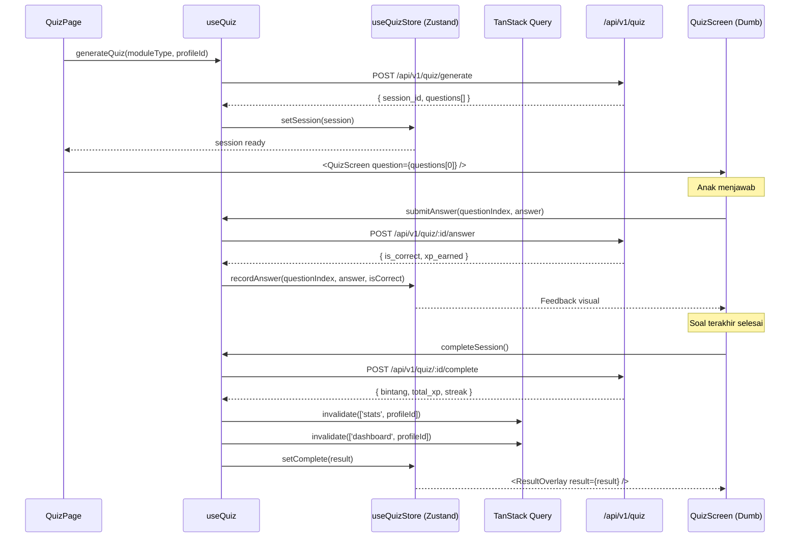

# 13_frontend_spec.md

## Frontend Specification: SAYA BACA

| Aspek | Keputusan |
|-------|-----------|
| **Nama Produk** | SAYA BACA |
| **Versi Dokumen** | 1.0 |
| **Tanggal** | 2026-05-01 |
| **Status** | Final |

---

### 1. Tujuan Dokumen

Dokumen ini mendefinisikan arsitektur frontend **SAYA BACA** secara menyeluruh. Mencakup prinsip Dumb UI, component tree berbasis Atomic Design, state management, data flow, dan struktur folder Next.js App Router. Dokumen ini menjadi kontrak bagi Agent Coder untuk merakit komponen dari UI Kit, membangun komponen tambahan, dan melakukan wiring ke backend.

---

### 2. Prinsip Dumb UI

| Prinsip | Implementasi |
|---------|-------------|
| **Komponen hanya render** | Komponen React hanya menerima props dan emit event. Tidak mengandung business logic, tidak fetch data langsung, tidak validasi bisnis. |
| **Business logic di service layer** | Semua logika (generate quiz, cek jawaban, hitung skor) berada di service/hook file terpisah. Komponen memanggil hook, hook mengembalikan data matang. |
| **Data matang dari server** | Soal kuis sudah lengkap (teks, opsi, jawaban benar, audio URL) sebelum dirender. Tidak ada pengolahan data di komponen. |
| **State seminimal mungkin** | Hanya state UI yang disimpan di komponen (loading, error, jawaban terpilih). State bisnis di Zustand store atau TanStack Query cache. |
| **Tidak ada hardcoding** | Semua URL API, konfigurasi, dan konstanta diambil dari environment variable atau file konfigurasi. |

---

### 3. Atomic Design Hierarchy

```
ATOM → MOLEKUL → ORGANISME → TEMPLATE/HALAMAN
```

#### 3.1 Atom (Komponen Dasar)

| Atom | Sumber | Props | Event |
|------|--------|-------|-------|
| `Button` | UI Kit | `variant: 'primary' \| 'secondary' \| 'option'`, `size: 'md' \| 'lg'`, `disabled`, `children` | `onClick` |
| `Icon` | UI Kit | `name: string`, `size: 'sm' \| 'md' \| 'lg'` | - |
| `Text` | UI Kit | `scale: 'small' \| 'default' \| 'large' \| 'xlarge'`, `uppercase: boolean`, `fontFamily: string`, `children` | - |
| `Badge` | UI Kit | `count: number`, `variant: 'streak' \| 'notification'` | - |
| `Avatar` | UI Kit | `src: string`, `alt: string`, `size: 'md' \| 'lg'` | - |
| `AudioButton` | **Baru** | `audioUrl?: string`, `ttsText?: string`, `muted: boolean` | `onPlay`, `onEnd` | 
| `Spinner` | UI Kit | `size: 'sm' \| 'md'` | - |

#### 3.2 Molekul (Gabungan Atom)

| Molekul | Sumber | Props | Event |
|---------|--------|-------|-------|
| `Card` | UI Kit | `title: string`, `subtitle?: string`, `children` | `onClick` |
| `ProgressBar` | UI Kit | `value: number`, `max: number`, `label?: string` | - |
| `StarRating` | UI Kit | `rating: number`, `max: number`, `animated: boolean` | - |
| `TimerDisplay` | **Baru** | `remainingSeconds: number`, `isWarning: boolean` | - |
| `StreakIndicator` | **Baru** | `streak: number`, `animated: boolean` | - |
| `OptionGrid` | **Baru** | `options: OptionItem[]`, `columns: 2 \| 3`, `disabledOptionIds: string[]` | `onSelect: (optionId: string) => void` |
| `AnswerSlot` | **Baru** | `slots: number`, `selectedItems: OptionItem[]`, `isCorrect?: boolean` | `onRemove: (index: number) => void` |
| `PinInput` | **Baru** | `length: number`, `error: boolean`, `locked: boolean` | `onComplete: (pin: string) => void` |

#### 3.3 Organisme (Gabungan Molekul & Atom)

| Organisme | Sumber | Props | Event |
|-----------|--------|-------|-------|
| `ModuleCard` | UI Kit | `module: ModuleData`, `locked: boolean` | `onClick` |
| `BottomNav` | UI Kit | `activeTab: string` | `onNavigate: (tab: string) => void` |
| `QuizScreen` | **Baru** | `session: QuizSession`, `currentQuestion: Question`, `selectedAnswer: any` | `onAnswer: (answer: any) => void`, `onNext: () => void`, `onReset: () => void` |
| `ResultOverlay` | **Baru** | `result: QuizResult` | `onContinue: () => void` |
| `PinPad` | **Baru** | `error: boolean`, `locked: boolean`, `lockedSeconds: number` | `onComplete: (pin: string) => void`, `onCancel: () => void` |
| `DashboardCard` | **Baru** | `title: string`, `value: string \| number`, `icon: string` | - |
| `TextControlPanel` | **Baru** | `settings: TextControlSettings` | `onChange: (settings: Partial<TextControlSettings>) => void` |

---

### 4. State Management

#### 4.1 Zustand Store (Client State)

| Store | State | Digunakan Oleh |
|-------|-------|---------------|
| `useAuthStore` | `{ account, profiles, activeProfileId, isAuthenticated }` | Semua halaman |
| `useQuizStore` | `{ currentSession, currentQuestionIndex, answers, isComplete }` | `QuizScreen` |
| `useTimerStore` | `{ remainingSeconds, isRunning, isExpired }` | `TimerDisplay` |
| `useUIStore` | `{ activeBottomTab, previousPath }` | `BottomNav`, navigasi |

#### 4.2 TanStack Query (Server State)

| Query Key | Endpoint | Digunakan Oleh |
|-----------|----------|---------------|
| `['profiles']` | `GET /api/v1/profiles` | `HomeScreen`, `ProfileSwitcher` |
| `['dashboard', profileId]` | `GET /api/v1/parental/:id/dashboard` | `DashboardScreen` |
| `['stats', profileId]` | `GET /api/v1/gamification/:id/stats` | `HomeScreen`, `ProfileScreen` |
| `['leaderboard', 'global']` | `GET /api/v1/leaderboard/global` | `LeaderboardScreen` |

#### 4.3 Mutasi

| Mutasi | Endpoint | Invalidate |
|--------|----------|------------|
| `useGenerateQuiz` | `POST /api/v1/quiz/generate` | - (tidak cache soal) |
| `useSubmitAnswer` | `POST /api/v1/quiz/:id/answer` | `['dashboard']` (setelah sesi selesai) |
| `useCompleteSession` | `POST /api/v1/quiz/:id/complete` | `['stats']`, `['dashboard']` |

---

### 5. Data Flow: Kuis Lengkap



**Aturan**:
- `QuizScreen` **tidak tahu** cara fetch soal, cara cek jawaban, cara hitung skor. Ia hanya render props dan emit event.
- `useQuiz` hook adalah **satu-satunya** tempat business logic kuis di frontend (memanggil API, mengelola state store).
- Data soal dari API sudah lengkap. `QuizScreen` tidak mengolah data lagi.

---

### 6. Routing & Folder Structure

#### 6.1 Next.js App Router

```
src/
├── app/
│   ├── layout.tsx                 # Root layout + provider
│   ├── page.tsx                   # Landing / redirect
│   ├── home/
│   │   └── page.tsx               # Home anak
│   ├── belajar/
│   │   ├── abjad/
│   │   │   ├── page.tsx           # Halaman belajar + kuis
│   │   │   └── loading.tsx
│   │   ├── vokal/
│   │   │   └── page.tsx
│   │   └── kalimat/
│   │       └── page.tsx
│   ├── leaderboard/
│   │   └── page.tsx
│   ├── profile/
│   │   └── page.tsx
│   ├── orang-tua/
│   │   ├── dashboard/
│   │   │   └── page.tsx
│   │   ├── pin/
│   │   │   └── page.tsx
│   │   └── pengaturan/
│   │       └── page.tsx
│   ├── api/                       # API Routes (lihat API Spec)
│   └── admin/
│       └── page.tsx
├── components/
│   ├── atoms/
│   │   ├── Button.tsx
│   │   ├── AudioButton.tsx        # Baru
│   │   ├── ...                    # Semua atom
│   ├── molecules/
│   │   ├── TimerDisplay.tsx       # Baru
│   │   ├── StreakIndicator.tsx    # Baru
│   │   ├── OptionGrid.tsx          # Baru
│   │   ├── AnswerSlot.tsx          # Baru
│   │   └── ...                    # Semua molekul
│   ├── organisms/
│   │   ├── ModuleCard.tsx
│   │   ├── BottomNav.tsx
│   │   ├── QuizScreen.tsx          # Baru
│   │   ├── ResultOverlay.tsx       # Baru
│   │   ├── PinPad.tsx              # Baru
│   │   ├── DashboardCard.tsx       # Baru
│   │   └── TextControlPanel.tsx    # Baru
│   └── templates/
│       ├── AppShell.tsx
│       └── QuizLayout.tsx
├── hooks/
│   ├── useAuth.ts
│   ├── useQuiz.ts
│   ├── useTimer.ts
│   ├── useTTS.ts
│   └── useOfflineSync.ts
├── stores/
│   ├── authStore.ts
│   ├── quizStore.ts
│   ├── timerStore.ts
│   └── uiStore.ts
├── services/
│   ├── api.ts                      # Axios/fetch wrapper
│   ├── quizApi.ts
│   ├── authApi.ts
│   └── syncService.ts
├── lib/
│   ├── constants.ts
│   ├── utils.ts
│   └── types.ts
└── config/
    └── env.ts                       # Environment variables
```

#### 6.2 Aturan Folder

- `components/` tidak boleh import dari `app/`.
- `hooks/` boleh import dari `services/` dan `stores/`.
- `services/` hanya berisi fungsi fetch API dan transform response ke tipe internal.
- `stores/` berisi Zustand store, tidak boleh fetch data langsung (panggil service/hook).

---

### 7. Komponen Baru yang Perlu Dibangun (Detail)

#### 7.1 `AudioButton` (Atom — Must)

| Aspek | Detail |
|-------|--------|
| **Fungsi** | Tombol dengan ikon speaker. Saat ditekan, memutar TTS (teks) atau audio URL. |
| **Props** | `ttsText?: string`, `audioUrl?: string`, `muted: boolean`, `iconSize?: 'sm' \| 'md' \| 'lg'` |
| **Event** | `onPlay?: () => void`, `onEnd?: () => void` |
| **State Internal** | `isPlaying: boolean` |
| **Perilaku** | Jika `muted`, ikon speaker dengan garis miring, disabled. Jika tidak, tap → panggil `SpeechSynthesis` API atau `<audio>` element. Animasi gelombang suara saat playing. |

#### 7.2 `OptionGrid` (Molekul — Must)

| Aspek | Detail |
|-------|--------|
| **Fungsi** | Grid berisi tombol opsi untuk kuis. |
| **Props** | `options: { id: string, text: string, disabled?: boolean }[]`, `columns: 2 \| 3`, `disabledOptionIds: string[]` |
| **Event** | `onSelect: (optionId: string) => void` |
| **Perilaku** | Merender grid. Opsi yang `disabled` atau `id`-nya ada di `disabledOptionIds` tampil redup, tidak bisa di-tap. Tap opsi aktif → emit `onSelect`. |

#### 7.3 `AnswerSlot` (Molekul — Must)

| Aspek | Detail |
|-------|--------|
| **Fungsi** | Deretan slot horizontal untuk menyusun jawaban di kuis "Susun Suku Kata" / "Susun Kalimat". |
| **Props** | `slots: number`, `selectedItems: { id: string, text: string }[]`, `isCorrect?: boolean` |
| **Event** | `onRemove: (index: number) => void` |
| **Perilaku** | Merender slot kosong (garis putus-putus). Slot yang terisi menampilkan teks dalam box. Tap slot terisi → emit `onRemove`. Jika `isCorrect === true`, semua slot berwarna hijau. Jika `false`, merah sejenak. |

#### 7.4 `QuizScreen` (Organisme — Must, Kompleks)

| Aspek | Detail |
|-------|--------|
| **Fungsi** | Layar kuis utama yang merakit `ProgressBar`, `AudioButton`, soal, `OptionGrid` atau `AnswerSlot`, tombol `Reset`. |
| **Props** | `session: QuizSession`, `currentQuestion: Question`, `questionIndex: number`, `totalQuestions: number`, `selectedAnswer: any`, `feedback?: { isCorrect: boolean, xpEarned: number }` |
| **Event** | `onAnswer: (answer: any) => void`, `onNext: () => void`, `onReset: () => void`, `onPlayAudio: () => void` |
| **Perilaku** | Tampilkan progress bar, audio button, area soal. Render `OptionGrid` untuk kuis pilihan atau `AnswerSlot` + `OptionGrid` untuk kuis susun. Setelah jawaban, tampilkan feedback visual (hijau/merah) lalu emit `onNext` otomatis setelah 1.5 detik. |
| **State** | Tidak ada business logic. Hanya state UI lokal: `isPlaying`, `selectedOptions`. |

#### 7.5 `ResultOverlay` (Organisme — Must)

| Aspek | Detail |
|-------|--------|
| **Fungsi** | Overlay hasil kuis: `StarRating` animasi, XP, `StreakIndicator`. |
| **Props** | `result: { bintang: number, total_xp: number, xp_earned: number, streak: number, level_up: boolean }` |
| **Event** | `onContinue: () => void` |
| **Perilaku** | Animasi bintang mengisi satu per satu, XP counter naik, streak api. Jika `level_up`, animasi khusus "Level Up!". Tombol "Lanjutkan". |

#### 7.6 `PinPad` (Organisme — Must)

| Aspek | Detail |
|-------|--------|
| **Fungsi** | Numeric keypad 4x3 + 4 indikator titik PIN. |
| **Props** | `error: boolean`, `locked: boolean`, `lockedSeconds: number` |
| **Event** | `onComplete: (pin: string) => void`, `onCancel: () => void` |
| **Perilaku** | Tap digit → indikator berubah ●. Setelah 4 digit, otomatis emit `onComplete`. Jika `error`, getar + indikator merah + reset. Jika `locked`, tampilkan hitungan mundur, semua tombol disabled. |

---

### 8. TTS & Audio Strategy

| Kebutuhan | Implementasi |
|-----------|-------------|
| **TTS Instruksi & Soal** | Gunakan `window.speechSynthesis` (Browser Speech Synthesis API). Pilih suara Bahasa Indonesia jika tersedia, fallback ke suara default. |
| **SFX (Sound Effect)** | Gunakan Howler.js. Preload file audio pendek: `click.mp3`, `correct.mp3`, `incorrect.mp3`, `complete.mp3`, `streak.mp3`, `timer-warning.mp3`. |
| **Audio URL** | Jika bank data menyediakan `audio_url`, gunakan `<audio>` element atau Howler untuk playback. |
| **Mute** | TTS dan SFX punya toggle terpisah (Text Control). Komponen `AudioButton` cek store sebelum memutar. |

---

### 9. Offline Strategy

| Aspek | Implementasi |
|-------|-------------|
| **Service Worker** | Workbox via `next-pwa`. Cache strategi: Cache First untuk asset statis (JS, CSS, font, SFX), Network First untuk API. |
| **Data Offline** | IndexedDB (via `idb-keyval`) menyimpan: profil anak, progress session quiz terakhir, hasil quiz (untuk sync nanti). |
| **Sync** | Saat online kembali, hook `useOfflineSync` kirim data dari IndexedDB ke server via `POST /api/v1/sync/push`. |
| **Indikator** | Jika offline, ikon cloud dengan garis miring di pojok atas. Konten yang sudah di-cache tetap bisa diakses. |

---

### 10. Performa & Optimasi

| Target | Strategi |
|--------|----------|
| **FCP < 2s** | SSG untuk halaman belajar statis, lazy load komponen berat (Howler). |
| **Transisi soal < 500ms** | Data semua soal sudah di store. `QuizScreen` hanya ganti index soal. Tidak ada fetch. |
| **Lighthouse Score ≥ 90** | Optimasi gambar (WebP), font subset Bahasa Indonesia, minimal JS bundle per halaman. |
| **PWA** | `manifest.json`, ikon 192px & 512px, tema warna, `display: standalone`. |