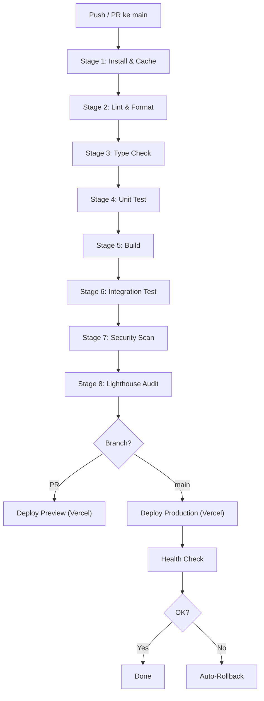

# 14_ci_cd_pipeline.md

## CI/CD Pipeline: SAYA BACA

| Aspek | Keputusan |
|-------|-----------|
| **Nama Produk** | SAYA BACA |
| **Versi Dokumen** | 1.0 |
| **Tanggal** | 2026-05-01 |
| **Status** | Final |

---

### 1. Tujuan Dokumen

Dokumen ini mendefinisikan pipeline Continuous Integration dan Continuous Deployment untuk SAYA BACA. Pipeline dirancang untuk menjamin kualitas kode, keamanan, dan zero-downtime deployment di Vercel. Agent Coder akan menggunakan konfigurasi ini sebagai dasar untuk file `.github/workflows/ci.yml` dan pengaturan Vercel.

---

### 2. Prinsip Pipeline

| Prinsip | Implementasi |
|---------|-------------|
| **Immutable Infrastructure** | Setiap deployment menghasilkan artifact baru (tidak patching di tempat). Next.js build menghasilkan bundle statis+serverless yang immutable. |
| **Zero-Downtime Deployment** | Vercel secara otomatis menyediakan deploy preview dan production dengan rollback instan. |
| **Quality Gates** | Setiap PR wajib lulus semua gate sebelum bisa di-merge ke `main`. |
| **Trunk-Based Development** | Branch `main` selalu siap deploy. Feature branch pendek (<3 hari), merge via squash. |
| **12-Factor Config** | Environment variable dikelola di Vercel dashboard, tidak ada di kode atau repo. |

---

### 3. Pipeline Stages



---

### 4. Stage Detail

#### 4.1 Stage 1: Install & Cache

| Atribut | Detail |
|---------|--------|
| **Perintah** | `npm ci --prefer-offline` |
| **Cache** | `node_modules/`, `.next/cache/`, `~/.npm` |
| **Timeout** | 3 menit |
| **Fail Jika** | Dependency tidak bisa diinstall |

#### 4.2 Stage 2: Lint & Format

| Atribut | Detail |
|---------|--------|
| **Lint** | `next lint --max-warnings 0` (ESLint dengan aturan strict) |
| **Format** | `prettier --check "src/**/*.{ts,tsx,json,css}"` |
| **Timeout** | 2 menit |
| **Fail Jika** | Ada warning lint atau format tidak sesuai |

#### 4.3 Stage 3: Type Check

| Atribut | Detail |
|---------|--------|
| **Perintah** | `tsc --noEmit` |
| **Timeout** | 3 menit |
| **Fail Jika** | Ada error TypeScript |

#### 4.4 Stage 4: Unit Test

| Atribut | Detail |
|---------|--------|
| **Framework** | Vitest (cepat, kompatibel dengan Vite) |
| **Perintah** | `npm run test:unit -- --coverage` |
| **Coverage Minimum** | ≥ 80% (line, branch, function, statement) |
| **Timeout** | 5 menit |
| **Fail Jika** | Ada test gagal atau coverage < 80% |

#### 4.5 Stage 5: Build

| Atribut | Detail |
|---------|--------|
| **Perintah** | `npm run build` (next build) |
| **Output** | `.next/` (standalone output untuk Vercel) |
| **Timeout** | 10 menit |
| **Fail Jika** | Build error atau warning build |

#### 4.6 Stage 6: Integration Test

| Atribut | Detail |
|---------|--------|
| **Framework** | Playwright (test E2E untuk Next.js) |
| **Perintah** | `npx playwright test` |
| **Timeout** | 8 menit |
| **Fail Jika** | Ada test E2E gagal |

#### 4.7 Stage 7: Security Scan

| Atribut | Detail |
|---------|--------|
| **Tools** | `npm audit` (dependency vuln), `trufflehog` (secret detection), `eslint-plugin-security` |
| **Perintah** | `npm audit --audit-level=high && trufflehog filesystem . --no-update` |
| **Timeout** | 3 menit |
| **Fail Jika** | Ada kerentanan high/critical atau terdeteksi secret di kode |

#### 4.8 Stage 8: Lighthouse Audit

| Atribut | Detail |
|---------|--------|
| **Tool** | `@lhci/cli` (Lighthouse CI) |
| **Target** | Performa ≥ 90, Aksesibilitas ≥ 90, PWA ≥ 90 |
| **Perintah** | `lhci autorun --config=lighthouserc.js` |
| **Timeout** | 5 menit |
| **Fail Jika** | Skor di bawah threshold |

---

### 5. Deployment

#### 5.1 Deploy Preview (Setiap PR)

| Atribut | Detail |
|---------|--------|
| **Platform** | Vercel (terintegrasi dengan GitHub) |
| **Trigger** | Setiap push ke PR atau commit baru |
| **URL** | `https://<branch>--sayabaca.vercel.app` (otomatis) |
| **Durasi** | ~30-60 detik |

#### 5.2 Deploy Production

| Atribut | Detail |
|---------|--------|
| **Trigger** | Merge ke `main` (setelah semua gates lulus) |
| **Domain** | `https://sayabaca.vercel.app` (atau custom domain) |
| **Rollback** | Otomatis jika health check gagal. Vercel menyediakan rollback instan ke deployment sebelumnya. |

#### 5.3 Environment Variables (Vercel Dashboard)

| Variable | Deskripsi |
|----------|-----------|
| `DATABASE_URL` | Connection string Supabase/PlanetScale |
| `FIREBASE_ADMIN_SDK_KEY` | Firebase Admin SDK service account key (base64) |
| `FIREBASE_API_KEY` | Firebase client API key (public) |
| `NEXT_PUBLIC_FIREBASE_API_KEY` | Firebase public key untuk client |
| `TTS_LANGUAGE` | `id-ID` (default Bahasa Indonesia) |
| `SENTRY_DSN` | DSN untuk error tracking |

---

### 6. GitHub Actions Workflow

```yaml
# .github/workflows/ci.yml
name: CI/CD Pipeline

on:
  push:
    branches: [main]
  pull_request:
    branches: [main]

jobs:
  quality:
    runs-on: ubuntu-latest
    steps:
      - uses: actions/checkout@v4
      - uses: actions/setup-node@v4
        with:
          node-version: 20
          cache: 'npm'
      - run: npm ci --prefer-offline
      - run: next lint --max-warnings 0
      - run: prettier --check "src/**/*.{ts,tsx,json,css}"
      - run: tsc --noEmit
      - run: npm run test:unit -- --coverage
      - run: npm run build
      - run: npx playwright test
      - run: npm audit --audit-level=high
      - run: lhci autorun --config=lighthouserc.js
        env:
          LHCI_GITHUB_APP_TOKEN: ${{ secrets.LHCI_GITHUB_APP_TOKEN }}
      - uses: trufflesecurity/trufflehog@main
        with:
          path: ./
          base: main
          head: HEAD

  deploy-preview:
    needs: quality
    if: github.event_name == 'pull_request'
    runs-on: ubuntu-latest
    steps:
      - uses: actions/checkout@v4
      - uses: amondnet/vercel-action@v25
        with:
          vercel-token: ${{ secrets.VERCEL_TOKEN }}
          vercel-org-id: ${{ secrets.VERCEL_ORG_ID }}
          vercel-project-id: ${{ secrets.VERCEL_PROJECT_ID }}
          github-comment: true

  deploy-production:
    needs: quality
    if: github.event_name == 'push' && github.ref == 'refs/heads/main'
    runs-on: ubuntu-latest
    steps:
      - uses: actions/checkout@v4
      - uses: amondnet/vercel-action@v25
        with:
          vercel-token: ${{ secrets.VERCEL_TOKEN }}
          vercel-org-id: ${{ secrets.VERCEL_ORG_ID }}
          vercel-project-id: ${{ secrets.VERCEL_PROJECT_ID }}
          vercel-args: '--prod'
```