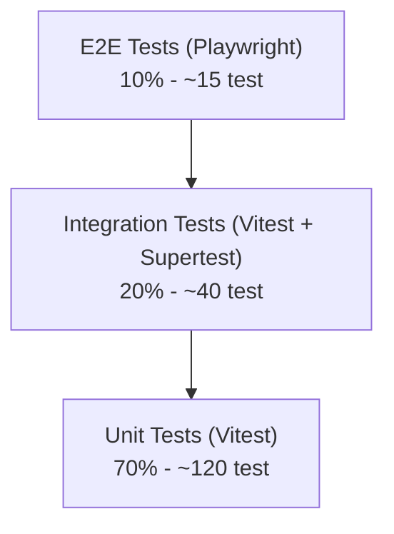

# 15_test_plan.md

## Test Plan: SAYA BACA

| Aspek | Keputusan |
|-------|-----------|
| **Nama Produk** | SAYA BACA |
| **Versi Dokumen** | 1.0 |
| **Tanggal** | 2026-05-01 |
| **Status** | Final |

---

### 1. Tujuan Dokumen

Dokumen ini mendefinisikan strategi pengujian menyeluruh untuk SAYA BACA. Mencakup workflow TDD (Test-Driven Development), test pyramid, target coverage, FIRST principles, dan pemetaan setiap Acceptance Criteria (AC) ke test case. Agent Coder wajib mengikuti test plan ini sebagai kontrak kualitas.

---

### 2. Prinsip Pengujian

| Prinsip | Implementasi |
|---------|-------------|
| **TDD Workflow** | 1. Tulis test gagal berdasarkan AC. 2. Implementasi kode minimal. 3. Refactor. |
| **Test Pyramid** | Unit (70%) > Integration (20%) > E2E (10%). |
| **Coverage ≥ 80%** | Line, branch, function, statement coverage minimal 80%. |
| **FIRST Principles** | Fast, Independent, Repeatable, Self-Validating, Timely. |
| **Setiap AC Punya Test** | Tidak ada acceptance criteria tanpa test case. |

---

### 3. Test Pyramid

| Level | Tool | Scope | Target Jumlah |
|-------|------|-------|---------------|
| **Unit** | Vitest + React Testing Library | Komponen atom/molekul, hooks, utility functions, engine logic. | 120+ |
| **Integration** | Vitest + Supertest (API Routes) | API endpoint, database query, engine-to-engine communication. | 40+ |
| **E2E** | Playwright | Critical user journeys (login, belajar, kuis, dashboard). | 15+ |

---

### 4. Unit Test Strategy

#### 4.1 Apa yang Diuji?

| Kategori | Contoh | Tools |
|----------|--------|-------|
| **Utility Functions** | `splitSyllables()`, `calculateBintang()`, `maskWord()`, `shuffleArray()` | Vitest |
| **Engine Logic** | Bank Data Engine query, Quiz Engine generation, Masking Engine masking, Result Engine scoring. | Vitest (mock DB) |
| **React Hooks** | `useQuiz`, `useTimer`, `useAuth`, `useTTS` | Vitest + React Hooks Testing Library |
| **Komponen Atom** | `Button`, `AudioButton`, `Text`, `Icon` | Vitest + React Testing Library |
| **Komponen Molekul** | `OptionGrid`, `AnswerSlot`, `TimerDisplay`, `StreakIndicator`, `StarRating`, `ProgressBar` | Vitest + React Testing Library |
| **Store (Zustand)** | `useQuizStore`, `useAuthStore`, `useTimerStore` | Vitest |

#### 4.2 Aturan Unit Test

- **Mock semua dependensi eksternal**: API calls, Firebase, SpeechSynthesis, IndexedDB, audio playback.
- **Tidak mock utility internal** yang sedang diuji.
- **Satu test = satu perilaku** (misal: "saat jawaban benar, XP bertambah 10").
- **Coverage target**: ≥ 80% line, branch, function, statement.

#### 4.3 Contoh Unit Test Case

| ID | Target | Test Case |
|----|--------|-----------|
| **UT-001** | `splitSyllables("pesawat")` | Harus mengembalikan `["pe", "sa", "wat"]`. |
| **UT-002** | `splitSyllables("cuci")` | Harus mengembalikan `["cu", "ci"]`. |
| **UT-003** | `calculateBintang(4, 5)` | 80% benar harus mengembalikan 4 bintang. |
| **UT-004** | `calculateBintang(5, 5)` | 100% benar harus mengembalikan 5 bintang. |
| **UT-005** | `maskWord("pesawat", [0])` | Harus mengembalikan `{ display: "_esawat", target: "p" }`. |
| **UT-006** | `maskWord("pesawat", [1,2])` | Harus mengembalikan `{ display: "pe__wat", target: "sa" }`. |
| **UT-007** | `QuizEngine.generate()` | Dengan bank data 20 kata, request 10 soal → harus kembalikan 10 soal unik. |
| **UT-008** | `QuizEngine.generate()` | Bank data < request count → kembalikan semua yang ada + warning. |
| **UT-009** | `ResultEngine.checkAnswer(benar)` | Jawaban benar → `{ isCorrect: true, xp: 10 }`. |
| **UT-010** | `ResultEngine.checkAnswer(salah)` | Jawaban salah → `{ isCorrect: false, xp: 0 }`. |

---

### 5. Integration Test Strategy

#### 5.1 Apa yang Diuji?

| Kategori | Contoh | Tools |
|----------|--------|-------|
| **API Routes** | Semua endpoint di `/api/v1/*` (auth, quiz, profiles, dashboard). | Vitest + Supertest (atau Next.js test helper). |
| **Engine Integration** | Bank Data → Quiz Engine → Masking Engine → Result Engine flow. | Vitest (dengan test database PostgreSQL). |
| **Auth Flow** | Verify token, link anonymous, profile CRUD. | Vitest + mock Firebase. |
| **Database Query** | Insert kata, query dengan filter level, pagination. | Vitest + Prisma + test DB. |

#### 5.2 Aturan Integration Test

- Gunakan **test database terpisah** (Supabase branch atau Docker PostgreSQL).
- Setiap test **seed data sendiri**, tidak bergantung pada data test lain.
- Bersihkan data setelah test selesai (atau gunakan transaksi rollback).
- Verifikasi response HTTP (status code, body shape), bukan hanya logika.

#### 5.3 Contoh Integration Test Case

| ID | Target | Test Case |
|----|--------|-----------|
| **IT-001** | `POST /api/v1/auth/verify` | Token valid → 200 + account data. Token invalid → 401. |
| **IT-002** | `POST /api/v1/profiles` | Buat profil anak → 201 + profil muncul di list. Tanpa auth → 401. |
| **IT-003** | `POST /api/v1/quiz/generate` | Request valid → 200 + `{ session_id, questions[] }`. Questions punya semua field wajib. |
| **IT-004** | `POST /api/v1/quiz/:id/answer` | Jawaban benar → 200 + `{ is_correct: true, xp_earned: 10 }`. |
| **IT-005** | `POST /api/v1/quiz/:id/complete` | Sesi selesai → 200 + `{ bintang, total_xp, streak }`. Stats terupdate di DB. |
| **IT-006** | `GET /api/v1/parental/:id/dashboard` | Data dashboard sesuai dengan data di DB. |
| **IT-007** | `PUT /api/v1/profiles/:id/pin` | PIN di-hash, tidak tersimpan plaintext di DB. |

---

### 6. E2E Test Strategy

#### 6.1 Apa yang Diuji?

| Journey | AC Terkait | Tool |
|---------|-----------|------|
| Onboarding orang tua + buat profil | AC-001, AC-002, AC-003 | Playwright |
| Belajar modul "Mengenal Abjad" | AC-102, AC-103 | Playwright |
| Kuis "Cari Huruf" full flow | AC-104, AC-105 | Playwright |
| Kuis "Susun Suku Kata" full flow | AC-108, AC-109 | Playwright |
| Hasil kuis + bintang + XP | AC-201, AC-203 | Playwright |
| Orang tua cek dashboard | AC-405 | Playwright |
| PIN input dan proteksi | AC-006, AC-007, AC-008 | Playwright |
| Timer belajar habis | AC-401, AC-402 | Playwright |
| Logout/ganti profil | AC-004 | Playwright |

#### 6.2 Aturan E2E Test

- Gunakan browser Chromium (headless di CI).
- **Mock Firebase Auth** untuk menghindari ketergantungan eksternal. Gunakan service worker mocking atau fixture.
- Setiap test **independen** (bisa dijalankan paralel).
- Gunakan `data-testid` attribute untuk selector, jangan bergantung pada kelas CSS atau teks.
- Screenshot dan video di-save hanya jika test gagal.

#### 6.3 Contoh E2E Test Case

| ID | Journey | Langkah | Ekspektasi |
|----|---------|---------|-----------|
| **E2E-001** | Onboarding | Buka `/`, klik "Langsung Belajar", buat profil "Bima". | Redirect ke Home. "Selamat datang, Bima!" terlihat. |
| **E2E-002** | Belajar Abjad | Tap modul "Mengenal Abjad", tap "Mulai Belajar". | Huruf A besar muncul + suara (cek `AudioButton` rendered). |
| **E2E-003** | Kuis Abjad | Selesaikan belajar, tap "Mulai Kuis", jawab semua soal. | Di akhir: `ResultOverlay` muncul dengan bintang dan XP. |
| **E2E-004** | Kuis Susun | Masuk kuis Susun Suku Kata, susun "CUCI". | Jika benar: "Heba!". Jika salah: tampilkan jawaban benar. |
| **E2E-005** | Dashboard | Login, input PIN, buka dashboard. | Data sesuai dengan sesi yang baru selesai. |
| **E2E-006** | PIN Lock | Salah input PIN 3x. | Numeric keypad terkunci, pesan "Coba lagi nanti" muncul. |
| **E2E-007** | Timer | Mulai belajar, tunggu hingga timer habis. | Overlay "Waktu Belajar Selesai!" muncul. |

---

### 7. Pemetaan AC ke Test (Sample)

| AC ID | Unit Test | Integration Test | E2E Test |
|-------|-----------|-----------------|----------|
| AC-001 | - | IT-001 | - |
| AC-002 | - | IT-001 | E2E-001 |
| AC-003 | - | IT-002 | E2E-001 |
| AC-006 | - | IT-007 | E2E-006 |
| AC-104 | - | IT-003 | E2E-003 |
| AC-105 | UT-009, UT-010 | IT-004 | E2E-003 |
| AC-108 | UT-008 | IT-003 | E2E-004 |
| AC-201 | UT-009 | - | E2E-003 |
| AC-203 | UT-003, UT-004 | - | E2E-003 |
| AC-401 | - | - | E2E-007 |
| AC-405 | - | IT-006 | E2E-005 |

---

### 8. Coverage & Reporting

| Metrik | Target |
|--------|--------|
| **Line Coverage** | ≥ 80% |
| **Branch Coverage** | ≥ 80% |
| **Function Coverage** | ≥ 80% |
| **Statement Coverage** | ≥ 80% |
| **Uncovered Lines** | Ditinjau di PR review. |
| **Report** | Laporan coverage di-generate oleh Vitest, di-upload ke GitHub Actions artifact. |

---

### 9. Test Execution di CI/CD

| Stage | Tests | Waktu Maks |
|-------|-------|------------|
| Install | - | 3 menit |
| Unit Test | Vitest (unit) | 5 menit |
| Integration Test | Vitest (integration, butuh test DB) | 5 menit |
| Build | Next.js build | 10 menit |
| E2E Test | Playwright | 8 menit |

**Aturan**:
- Unit test berjalan paralel dengan lint/format/type check.
- Integration test berjalan setelah build.
- E2E test berjalan di akhir.
- Jika ada test gagal, pipeline berhenti dan PR tidak bisa di-merge.