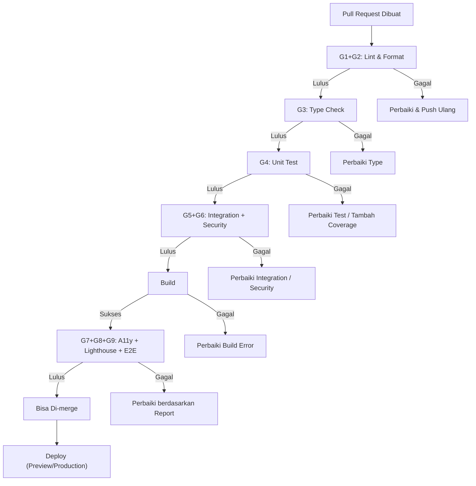

# 16_qa_gate.md

## QA Gate: SAYA BACA

| Aspek | Keputusan |
|-------|-----------|
| **Nama Produk** | SAYA BACA |
| **Versi Dokumen** | 1.0 |
| **Tanggal** | 2026-05-01 |
| **Status** | Setuju |

---

### 1. Tujuan Dokumen

Dokumen ini mendefinisikan **Quality Assurance Gate** — serangkaian gerbang kualitas yang wajib dilalui oleh setiap Pull Request sebelum bisa di-merge ke branch `main`. QA Gate ini adalah lapisan pertahanan otomatis yang memastikan tidak ada regresi, kerentanan, atau pelanggaran standar yang lolos ke production.

---

### 2. Daftar Gerbang

| Gate | Stage di CI/CD | Sifat | Durasi Maks |
|------|---------------|-------|-------------|
| **G1: Linting** | Stage 2 | Blocking | 2 menit |
| **G2: Formatting** | Stage 2 | Blocking | 1 menit |
| **G3: Type Check** | Stage 3 | Blocking | 3 menit |
| **G4: Unit Test** | Stage 4 | Blocking | 5 menit |
| **G5: Integration Test** | Stage 6 | Blocking | 5 menit |
| **G6: Security Scan** | Stage 7 | Blocking | 3 menit |
| **G7: Accessibility Check** | Stage 8 | Blocking | 5 menit |
| **G8: Lighthouse Audit** | Stage 8 | Blocking | 5 menit |
| **G9: E2E Test** | Stage 6 | Blocking | 8 menit |

---

### 3. G1: Linting

| Atribut | Detail |
|---------|--------|
| **Alat** | ESLint dengan konfigurasi `eslint-config-next` + plugin tambahan |
| **Perintah** | `next lint --max-warnings 0` |
| **Aturan Kunci** | `no-unused-vars` (error), `no-console` (warn, kecuali `warn`/`error`), `react-hooks/rules-of-hooks` (error), `@typescript-eslint/no-explicit-any` (warn), `import/no-cycle` (error) |
| **Kriteria Lulus** | Tidak boleh ada error atau warning. Setiap warning dianggap gagal (`--max-warnings 0`). |
| **Konsekuensi Gagal** | Pipeline berhenti. Developer wajib perbaiki sebelum push ulang. |
| **AC Terkait** | Semua AC (kualitas kode global) |

---

### 4. G2: Formatting

| Atribut | Detail |
|---------|--------|
| **Alat** | Prettier |
| **Perintah** | `prettier --check "src/**/*.{ts,tsx,json,css,md}"` |
| **Konfigurasi** | `.prettierrc` di root repo: `singleQuote: true`, `semi: true`, `tabWidth: 2`, `trailingComma: "all"`, `printWidth: 100` |
| **Kriteria Lulus** | Semua file sesuai format Prettier. Tidak ada perubahan yang diperlukan. |
| **Konsekuensi Gagal** | Pipeline berhenti. Developer bisa menjalankan `prettier --write` lokal untuk auto-fix. |
| **AC Terkait** | Semua AC (kualitas kode global) |

---

### 5. G3: Type Check

| Atribut | Detail |
|---------|--------|
| **Alat** | TypeScript Compiler (`tsc`) |
| **Perintah** | `tsc --noEmit` |
| **Konfigurasi** | `tsconfig.json` dengan `strict: true`, `noUncheckedIndexedAccess: true`, `noImplicitReturns: true` |
| **Kriteria Lulus** | Tidak ada error TypeScript di seluruh project. |
| **Konsekuensi Gagal** | Pipeline berhenti. Developer wajib perbaiki typing. |
| **AC Terkait** | Semua AC (type safety global) |

---

### 6. G4: Unit Test

| Atribut | Detail |
|---------|--------|
| **Alat** | Vitest + React Testing Library |
| **Perintah** | `npm run test:unit -- --coverage` |
| **Coverage Minimum** | Line ≥ 80%, Branch ≥ 80%, Function ≥ 80%, Statement ≥ 80% |
| **Kriteria Lulus** | Semua test PASS. Coverage memenuhi threshold. |
| **Konsekuensi Gagal** | Pipeline berhenti. Coverage report di-upload sebagai artifact. |
| **AC Terkait** | Semua AC yang dipetakan ke unit test (lihat `15_test_plan.md`) |

---

### 7. G5: Integration Test

| Atribut | Detail |
|---------|--------|
| **Alat** | Vitest + Supertest (API Routes) |
| **Perintah** | `npm run test:integration` |
| **Test Database** | Database PostgreSQL test (Docker atau Supabase branch) |
| **Kriteria Lulus** | Semua integration test PASS. |
| **Konsekuensi Gagal** | Pipeline berhenti. Log API response di-upload. |
| **AC Terkait** | AC-001 s/d AC-009 (Auth), AC-301 s/d AC-311 (Engine), AC-401 s/d AC-408 (Parental) |

---

### 8. G6: Security Scan

| Atribut | Detail |
|---------|--------|
| **Alat** | `npm audit` (dependency), `trufflehog` (secret detection), `eslint-plugin-security` (code scan) |
| **Perintah** | `npm audit --audit-level=high && trufflehog filesystem . --no-update --fail` |
| **Kriteria Lulus** | Tidak ada kerentanan high/critical. Tidak ada hardcoded secret, API key, atau kredensial di kode. |
| **Konsekuensi Gagal** | Pipeline berhenti. Report kerentanan di-upload. Jika secret terdeteksi, segera rotasi kredensial yang bocor. |
| **AC Terkait** | NFR-003 (Keamanan), AC-006 s/d AC-008 (PIN), AC-302, AC-303 (data aman) |

---

### 9. G7: Accessibility Check

| Atribut | Detail |
|---------|--------|
| **Alat** | `@axe-core/playwright` (diintegrasikan ke Playwright test) |
| **Perintah** | `npx playwright test --project=accessibility` |
| **Target** | Tidak boleh ada pelanggaran aksesibilitas level "critical" atau "serious" di semua halaman utama. |
| **Aturan Kunci** | `button-name` (tombol punya accessible name), `color-contrast` (kontras teks cukup), `html-has-lang`, `link-name`, `image-alt` |
| **Kriteria Lulus** | Semua halaman (Home, Belajar, Kuis, Dashboard) lulus audit axe-core. |
| **Konsekuensi Gagal** | Pipeline berhenti. Report aksesibilitas di-upload. |
| **AC Terkait** | AC-101, AC-102, AC-104, AC-106, AC-108, AC-405, NFR-004 |

---

### 10. G8: Lighthouse Audit

| Atribut | Detail |
|---------|--------|
| **Alat** | `@lhci/cli` (Lighthouse CI) |
| **Perintah** | `lhci autorun --config=lighthouserc.js` |
| **Konfigurasi** | Assert: `performance ≥ 90`, `accessibility ≥ 90`, `best-practices ≥ 90`, `pwa ≥ 90` |
| **Halaman yang Diaudit** | `/` (Landing), `/home` (Home), `/belajar/abjad` (Belajar), `/orang-tua/dashboard` (Dashboard) |
| **Kriteria Lulus** | Semua halaman memenuhi threshold. |
| **Konsekuensi Gagal** | Pipeline berhenti. Report Lighthouse di-upload. |
| **AC Terkait** | NFR-004, AC-501 (PWA), AC-502 (Offline) |

---

### 11. G9: E2E Test

| Atribut | Detail |
|---------|--------|
| **Alat** | Playwright |
| **Perintah** | `npx playwright test` |
| **Test Suite** | 15+ test case berdasarkan critical user journeys (lihat `15_test_plan.md`) |
| **Browser** | Chromium headless |
| **Kriteria Lulus** | Semua test PASS. Screenshot/video hanya diambil jika gagal. |
| **Konsekuensi Gagal** | Pipeline berhenti. Screenshot + video di-upload ke artifact. |
| **AC Terkait** | Semua AC di journey utama (Onboarding, Belajar, Kuis, Dashboard, PIN, Timer) |

---

### 12. Flow QA Gate

---

### 13. Integrasi dengan GitHub

| Fitur | Implementasi |
|-------|-------------|
| **Branch Protection** | Branch `main` diproteksi. Tidak bisa push langsung. PR wajib. |
| **Required Status Checks** | Semua gate (G1 s/d G9) wajib PASS sebelum tombol "Merge" aktif. |
| **PR Comment** | Vercel bot otomatis comment dengan preview URL. |
| **Artifact** | Coverage report, Lighthouse report, Playwright screenshot/video di-upload ke GitHub Actions artifact. |